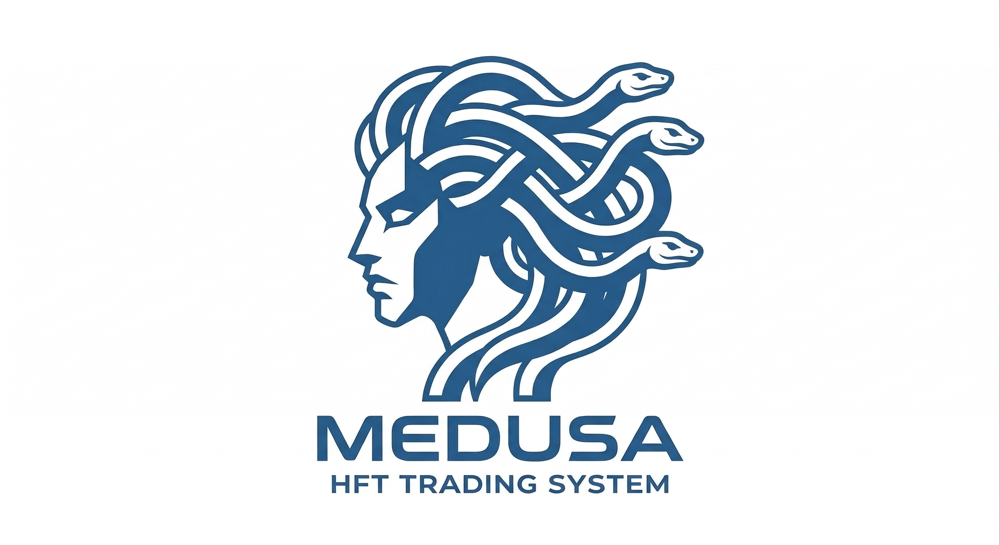

<p align="center">
  
</p>

<h1 align="center">Medusa</h1>
<p align="center"><strong>Multi-Language Algorithmic Trading System</strong></p>
<p align="center">kdb+tick architecture with TorQ framework for production HFT infrastructure</p>

---

A multi-language algorithmic trading system inspired by Gryphon, built with:
- **q/kdb+**: Core trading engine, in-memory analytics, and schema
- **Rust**: High-performance exchange connectors and IPC bridge
- **Python**: Backtesting, research, and data analysis

## Wave Status

| Wave | Component | Status |
|------|-----------|--------|
| 1 | Core foundations (schema, money, config) | COMPLETE |
| 2 | Exchange abstraction layer (q + Rust) | COMPLETE |
| 3+4 | kdb+ IPC bridge + Strategy engine | COMPLETE |
| 5 | Exchange coordinator + Arbitrage library | COMPLETE |
| 6 | Market making library + Production strategies | COMPLETE |
| 7 | GDS subscribers (orderbook, trade, auditor) | COMPLETE |
| 8 | Python research & backtesting framework | COMPLETE |
| 9 | Risk management | PLANNED |
| 10 | Production deployment + monitoring | PLANNED |

## Project Structure

```
medusa/
├── src/
│   ├── q/          # q/kdb+ trading engine (TorQ + kdb+tick)
│   │   ├── schema/     # Table schemas (trade, order, exchange events)
│   │   ├── config/     # Configuration management
│   │   ├── exchange/   # Exchange abstraction layer
│   │   ├── engine/     # Strategy execution engine
│   │   ├── strategy/   # Arbitrage, market making strategies
│   │   ├── lib/        # Money library (fixed-precision)
│   │   ├── tick/       # kdb+tick (TP, RDB, HDB)
│   │   ├── gds/        # Guardian Data System auditors
│   │   ├── audit/      # Audit trail
│   │   └── risk/       # Risk management (planned)
│   ├── rust/       # Rust workspace (6 crates)
│   │   ├── exchange-connector/       # Exchange API clients
│   │   ├── exchange-daemon/          # Exchange ↔ kdb+ bridge
│   │   ├── kdb-ipc/                  # kdb+ IPC protocol
│   │   ├── gds-common/               # GDS infrastructure
│   │   ├── gds-orderbook-subscriber/ # Orderbook subscriber
│   │   └── gds-trade-subscriber/     # Trade subscriber
│   └── python/     # Python research framework (PyKX)
│       └── medusa/
│           ├── data/       # KDB+, CSV, Parquet loaders
│           ├── backtest/   # VectorBT + NautilusTrader engines
│           ├── models/     # LSTM, Transformer, TFT, N-BEATS, XGBoost
│           ├── features/   # Technical indicators, preprocessing
│           ├── analytics/  # QuantStats tearsheets, risk metrics
│           ├── strategies/ # BaseStrategy + examples
│           ├── live/       # TP subscriber, signal tester
│           └── utils/      # Config, logging
├── configs/        # Strategy and exchange configurations
├── data/           # Market data (gitignored)
├── scripts/        # Setup and build scripts
└── ai/             # AI-assisted development artifacts
```

## Quick Start

### Prerequisites
- kdb+ 4.x (or use Docker)
- Rust 1.75+ (`rustup`)
- Python 3.11+
- Docker & Docker Compose (for development environment)

### Build Everything

```bash
# One-command build
make all

# Or build individually
make rust     # Build Rust workspace
make python   # Install Python package
make q        # Validate q source
```

### Run Development Environment

```bash
# Launch all services (kdb+, Rust daemon, Jupyter)
make docker-up

# Access Jupyter notebooks
open http://localhost:8888

# Connect to kdb+ REPL
rlwrap q src/q/init.q
```

### Run Tests

```bash
make test         # All tests
make test-rust    # Rust only
make test-python  # Python only (65 tests)
make test-q       # q only
```

## Architecture

### Data Flow (kdb+tick)

```
Exchanges (Bitstamp, Coinbase, Kraken)
    │
    ▼
Rust GDS Subscribers (WebSocket + REST)
    │
    ├──> Market Data (orderbooks, trades)
    │    │
    │    ▼
    │    Tickerplant (TP, port 5010)     ← .u.upd from Rust
    │        │
    │        ├──→ RDB (port 5011)        ← in-memory, current day
    │        ├──→ HDB (port 5012)        ← on-disk, historical partitioned
    │        ├──→ Strategy Engine (q)     ← .u.sub for real-time signals
    │        ├──→ GDS Auditors (q)       ← .u.sub for monitoring
    │        └──→ Python (PyKX)          ← .u.sub for live ML inference
    │
    └──> Execution Reports
         └──> Tickerplant
              └──> Audit trail
```

### Language Responsibilities

| Language | Role | Key Components |
|----------|------|----------------|
| **q/kdb+** | Core engine | Schema, strategy engine, tick infrastructure, config, exchange abstraction, audit |
| **Rust** | Connectors | Exchange REST+WS clients, kdb+ IPC bridge, GDS data subscribers |
| **Python** | Research | VectorBT backtesting, PyTorch models, feature engineering, QuantStats analytics |

## Python Research Framework

The Python layer provides a comprehensive research and backtesting environment:

### Backtesting Engines
- **VectorBT**: Vectorized backtesting with portfolio optimization, fast signal-based strategies
- **NautilusTrader** (skeleton): Event-driven backtesting for low-latency strategy validation

### Machine Learning Models
- **LSTM**: Sequential time-series forecasting
- **Transformer**: Attention-based multi-horizon prediction
- **TFT** (Temporal Fusion Transformer): Interpretable multi-horizon forecasting
- **N-BEATS**: Neural basis expansion for time-series
- **XGBoost**: Gradient boosting for feature-rich predictions

### Feature Engineering
- Technical indicators (RSI, MACD, Bollinger Bands, ATR)
- Preprocessing pipeline (normalization, scaling, windowing)
- Feature selection and importance analysis

### Analytics
- **QuantStats**: Performance tearsheets (Sharpe, Sortino, max drawdown)
- **Risk metrics**: VaR, CVaR, beta, alpha, information ratio
- **Portfolio optimization**: Mean-variance, Black-Litterman, risk parity

### Live Trading Integration
- **TP Subscriber**: Real-time data from kdb+ Tickerplant via PyKX
- **Signal Tester**: Validate ML signals against live data before deployment
- **Order Publisher**: Publish strategy signals back to kdb+ engine via `.u.upd`

### Workflow Example

```python
from medusa.data import KdbDataLoader
from medusa.strategies import sma_crossover_signals
from medusa.backtest import VectorBTEngine
from medusa.analytics import PerformanceTearsheet

# Load data from kdb+ HDB
loader = KdbDataLoader(host="localhost", port=5012)
df = loader.load_ohlcv(symbol="BTCUSD", start="2024.01.01", end="2024.12.31")

# Generate signals
entries, exits = sma_crossover_signals(df['close'], fast=10, slow=50)

# Backtest
engine = VectorBTEngine()
portfolio = engine.run_signals(df['close'], entries, exits, init_cash=100000)

# Analyze
tearsheet = PerformanceTearsheet.generate_html(portfolio.returns())
print(f"Sharpe Ratio: {portfolio.sharpe_ratio():.2f}")
print(f"Max Drawdown: {portfolio.max_drawdown():.2%}")
```

## Key Conventions

- **Fixed-precision money**: All prices/volumes are `long` in q (6 decimal places). Use `.money` namespace.
- **Symbol format**: Uppercase alphanumeric (e.g., `BTCUSD`, `ETHUSD`)
- **Config**: q uses `.config` namespace; Python uses Pydantic Settings with `MEDUSA_` env prefix
- **Logging**: q uses built-in; Rust uses `tracing`; Python uses `loguru`
- **Testing**: Rust=cargo test, Python=pytest (65 tests), q=test/*.q scripts

## Development Workflow

### Adding a new strategy (q)
1. Create `src/q/strategy/myStrategy.q`
2. Register in strategy engine via `.engine.strategy.register`
3. Test in dryrun mode: `.engine.mode.set[\`dryrun]`

### Running a Python backtest
1. `cd src/python && source .venv/bin/activate`
2. Load data: `KdbDataLoader` or `CsvDataLoader`
3. Generate signals: implement `BaseStrategy` or use built-in functions
4. Backtest: `VectorBTEngine().run_signals(price, entries, exits)`
5. Analyze: `RiskAnalytics.full_report(returns)` or `PerformanceTearsheet.generate_html(returns)`

### Adding a new exchange (Rust)
1. Add exchange module in `exchange-connector/src/exchanges/`
2. Implement `ExchangeClient` trait (REST) and `WebSocketFeed` trait (WS)
3. Register in `exchange-daemon` routing
4. Add GDS subscriber config for the exchange

## Known Issues

- **XGBoost segfaults on macOS arm64** with numpy 2.x — tests are skip-guarded
- **Risk module empty** — Wave 9 planned
- **NautilusTrader** is skeleton only — event-driven backtesting incomplete

## License

MIT License - See LICENSE file
