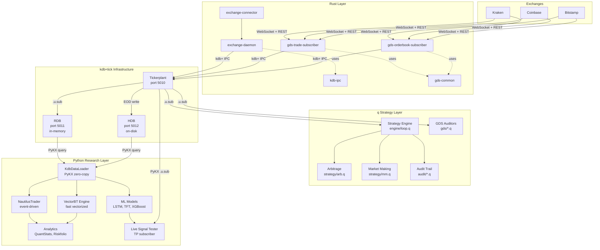
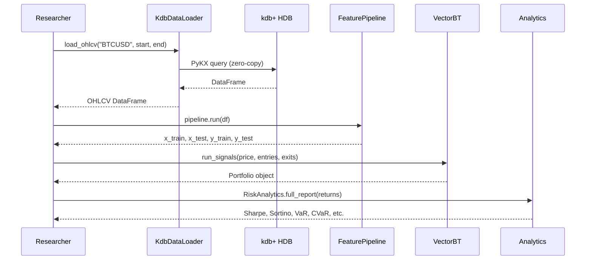
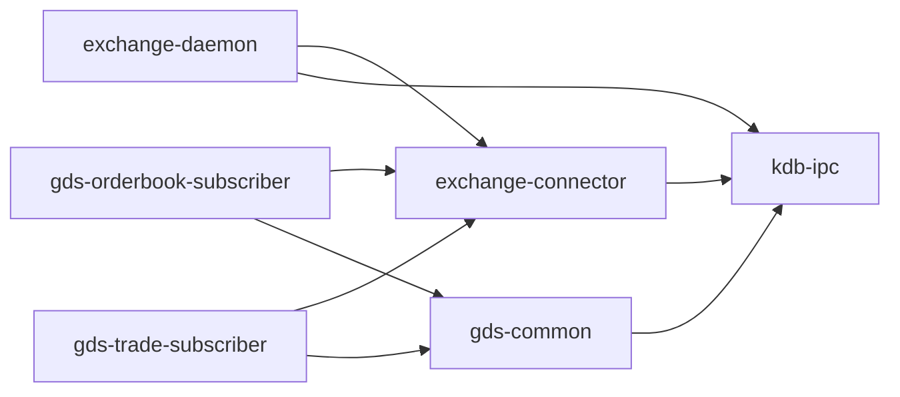

# Medusa System Architecture

## Overview

Medusa is a multi-language algorithmic trading system built on three pillars:

1. **q/kdb+** — Core trading engine and tick database (sub-millisecond analytics)
2. **Rust** — Exchange connectivity and data ingestion (safe concurrency, low latency)
3. **Python** — Research, backtesting, and machine learning (rich ecosystem)

The system uses **kdb+tick** as its central message bus, connecting all components through a publish-subscribe architecture.

## System Diagram



## Data Flow

### Market Data Ingestion (Rust → kdb+)

```mermaid
sequenceDiagram
    participant EX as Exchange WS
    participant SUB as GDS Subscriber
    participant TP as Tickerplant
    participant RDB as RDB
    participant HDB as HDB
    participant STR as Strategy Engine

    EX->>SUB: WebSocket orderbook/trade update
    SUB->>SUB: Validate sequence, detect gaps
    SUB->>TP: .u.upd[`marketData; data]
    TP->>RDB: Append to in-memory table
    TP->>STR: Forward to subscribed strategies
    Note over RDB,HDB: End-of-day
    RDB->>HDB: Write partitioned data to disk
    RDB->>RDB: Clear in-memory tables
```

### Research Workflow (Python)



## Component Details

### kdb+tick Infrastructure

| Process | Port | Role | Data |
|---------|------|------|------|
| Tickerplant | 5010 | Central message bus | Receives all market data, distributes to subscribers |
| RDB | 5011 | Real-time database | In-memory, current day, sub-millisecond queries |
| HDB | 5012 | Historical database | On-disk, date-partitioned, long-term storage |

### Rust Crate Dependency Graph



### q Module Dependencies

```
init.q
├── schema/init.q (tables, types, metadata)
├── lib/ (money)
├── config/ (settings management)
├── exchange/ (abstraction layer)
├── engine/ (strategy execution)
│   ├── mode.q (dryrun/paper/live)
│   ├── loop.q (tick loop)
│   ├── strategy.q (registry)
│   ├── position.q (tracking)
│   ├── orders.q (management)
│   ├── harness.q (exchange wrapper)
│   └── history.q (price cache)
├── strategy/ (implementations)
│   ├── arb.q (arbitrage library)
│   ├── mm.q (market making library)
│   ├── simpleArb.q (example)
│   └── simpleMM.q (example)
├── tick/ (kdb+tick: u.q, r.q, sym.q)
├── gds/ (Guardian Data System auditors)
├── audit/ (order, position, ledger tracking)
└── risk/ (planned — Wave 9)
```

### Python Package Structure

```
medusa/
├── data/           KdbDataLoader (PyKX), CsvDataLoader, ParquetDataLoader (Polars)
├── backtest/       VectorBTEngine (fast), NautilusEngine (event-driven skeleton)
├── models/         LightningAlphaModel base, LSTM, TFT, N-BEATS, Transformer, XGBoost
├── features/       Technical indicators, FeatureScaler, FeaturePipeline
├── analytics/      PerformanceTearsheet (QuantStats), RiskAnalytics, PortfolioOptimizer (Riskfolio)
├── strategies/     BaseStrategy ABC, SMACrossoverStrategy example
├── live/           TickSubscriber, LiveSignalTester, OrderPublisher
└── utils/          Pydantic Settings, loguru logging
```

## Design Decisions

| Decision | Rationale |
|----------|-----------|
| q/kdb+ for core engine | Sub-millisecond in-memory analytics, native time-series, kdb+tick proven architecture |
| Rust for exchange I/O | Safe concurrency (no data races), zero-cost abstractions, async/await for WebSocket streams |
| Python for research | Rich ML ecosystem (PyTorch, scikit-learn), Jupyter notebooks, QuantStats for reporting |
| PyKX over qPython | Zero-copy data transfer, modern API, maintained by KX, supports TP subscription |
| Two-tier backtesting | VectorBT for fast parameter sweeps (millions of sims), NautilusTrader for execution realism |
| Fixed-precision money | Avoids floating-point errors in financial calculations — all prices as long (6 decimals) |
| kdb+tick as message bus | Battle-tested pub/sub, handles millions of messages/second, natural for time-series |

## Deployment Model

Current: Single-machine development (all processes on localhost).

Planned (Wave 10):
- Docker Compose with process-per-container
- TP, RDB, HDB, Strategy Engine as separate q processes
- Rust daemons as separate containers per exchange
- Python Jupyter as a research container with PyKX access to kdb+ network
